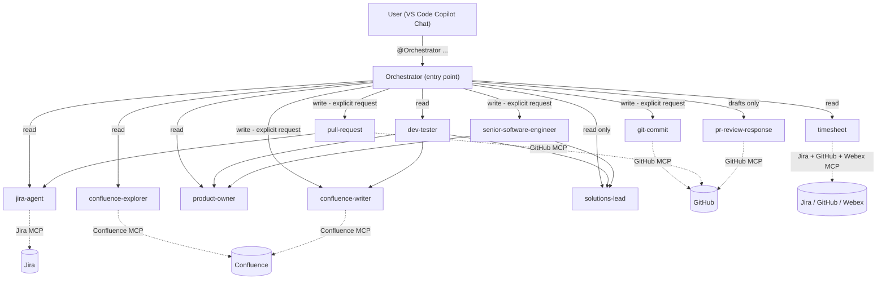

# MG-Agents-Prompts-By-Natha-Tarkhala

**MG: AI Agents + Orchestrators + Prompts** — a 12-agent, hub-and-spoke Copilot agent suite for end-to-end Salesforce delivery: Jira intake, Confluence documentation, code implementation, code review, PR creation, PR-feedback triage, dev testing, and timesheeting.

Built for VS Code Copilot **custom agents** (`.github/agents/*.agent.md`) and **workflow prompts** (`.github/prompts/*.prompt.md`).

---

## Table of Contents

- [Overview](#overview)
- [Architecture](#architecture)
- [Repository Structure](#repository-structure)
- [Agent Roster](#agent-roster)
- [Workflow Prompts](#workflow-prompts)
- [Core Design Principles](#core-design-principles)
- [Workflow Playbooks](#workflow-playbooks)
- [Routing Cheat Sheet](#routing-cheat-sheet)
- [Side-Effect Discipline](#side-effect-discipline)
- [Installation / Reuse in Another Repo](#installation--reuse-in-another-repo)
- [Configuration Required](#configuration-required)
- [Plan / Dry-Run Mode](#plan--dry-run-mode)
- [Known Issues / Notes](#known-issues--notes)
- [Editing & Extending](#editing--extending)
- [License](#license)

---

## Overview

This repository packages a complete **Orchestrator-Worker** multi-agent system for GitHub Copilot Chat (agent mode). A single user-invocable **Orchestrator** agent decomposes any request — a Jira story, a PR review, a dev-testing wiki page, a timesheet — and delegates to specialized, non-user-invocable subagents, each scoped to one concern (Jira, Confluence, code, review, Git/PR, timesheets).

It was originally built inside a Salesforce DX workspace (Paychex COE), but the pattern, prompts, and agent definitions are portable to any repo that wants a structured, tool-scoped, multi-agent Copilot workflow — Jira/Confluence/GitHub MCP servers are the only hard dependency, and even those can be swapped out per-project.

## Architecture



**Pattern:** hub-and-spoke, unidirectional communication (Orchestrator → agents only), dynamic parallel execution, dependency-aware sequencing, lifecycle-driven Jira transitions, graceful error recovery.

## Repository Structure

```
.github/
  agents/
    AGENT-ORCHESTRATOR-README.md     ← suite overview (agent roster, routing, playbooks)
    orchestrator.agent.md            ← single entry point (user-invocable)
    jira-agent.agent.md              ← Jira CRUD + lifecycle transitions
    confluence-explorer.agent.md     ← read-only Confluence search
    confluence-writer.agent.md       ← Confluence page creation/updates
    product-owner.agent.md           ← project memory / historical context
    senior-software-engineer.agent.md← Salesforce code implementation
    solutions-lead.agent.md          ← architecture / security / code review
    git-commit.agent.md              ← branches + Conventional Commits
    pull-request.agent.md            ← PR creation + Jira sync
    pr-review-response.agent.md      ← PR feedback triage (drafts only)
    dev-tester.agent.md              ← dev-testing wiki design (PO+SL verified)
    timesheet.agent.md               ← Jira + Git + Webex activity rollup
  prompts/
    develop.prompt.md                ← /develop   — story → code → review → PR
    pr-reviewer.prompt.md            ← /pr-reviewer — PR → structured review
    dev-tester.prompt.md             ← /dev-tester — story → dev-testing wiki
    timesheet-filler.prompt.md       ← /timesheet-filler — weekly timesheet
    analyze-jira.prompt.md           ← standalone Jira ticket analysis
    create-pr.prompt.md              ← standalone PR creation (legacy, single-agent)
    update-confluence.prompt.md      ← standalone Confluence page create/update
    e2e-workflow.prompt.md           ← legacy full E2E workflow prompt
README.md                            ← this file
```

## Agent Roster

| # | Agent | File | Suggested Model | User-invocable | Role |
|---|---|---|---|:---:|---|
| 1 | **Orchestrator** | `orchestrator.agent.md` | Claude Sonnet 4.5 | ✅ | Single entry point — routes & synthesizes |
| 2 | Jira Agent | `jira-agent.agent.md` | GPT-5 mini | ❌ | Jira CRUD + the only Jira writer (lifecycle transitions) |
| 3 | Confluence Explorer | `confluence-explorer.agent.md` | GPT-5 mini | ❌ | Read-only Confluence search & retrieval |
| 4 | Confluence Writer | `confluence-writer.agent.md` | Claude Sonnet 4.5 | ❌ | Creates/updates wiki pages (dev test plans, docs) |
| 5 | Product Owner | `product-owner.agent.md` | Claude Sonnet 4.5 | ❌ | Project memory: historical context & precedent |
| 6 | Senior Software Engineer | `senior-software-engineer.agent.md` | Claude Opus 4.1 | ❌ | Salesforce Apex/LWC/Flow implementation, org-synced |
| 7 | Solutions Lead | `solutions-lead.agent.md` | Claude Opus 4.1 | ❌ | Architecture, security, governor-limit review (read-only) |
| 8 | Git Commit | `git-commit.agent.md` | GPT-5 mini | ❌ | Feature branches + atomic Conventional Commits |
| 9 | Pull Request | `pull-request.agent.md` | Claude Sonnet 4.5 | ❌ | PR markdown + PR creation + Jira sync |
| 10 | PR Review Response | `pr-review-response.agent.md` | Claude Opus | ❌ | Categorizes PR feedback, drafts fixes/replies (no auto-post) |
| 11 | Timesheet | `timesheet.agent.md` | GPT-5 / Sonnet 4 | ❌ | Aggregates Jira + Git + Webex into a daily timesheet |
| 12 | Dev Tester | `dev-tester.agent.md` | GPT-5-Codex / Sonnet 4.5 | ❌ | Designs CASM-format dev-testing wiki pages, PO+SL verified |

Only the **Orchestrator** is `user-invocable: true` — every other agent is a subagent reachable only through delegation, keeping the chat's agent picker clean and forcing all requests through the same guardrails.

## Workflow Prompts

Four thin, end-to-end prompts drive the Orchestrator's playbooks via the `/` menu in Copilot Chat; four legacy single-agent prompts remain for narrower, standalone tasks.

| Prompt | File | Purpose |
|---|---|---|
| `/develop` | `develop.prompt.md` | Story → clarify gaps → implement (org-synced) → PO+SL review → user approval → branch/commit off **N2A** → PR → Jira sync |
| `/pr-reviewer` | `pr-reviewer.prompt.md` | Story + PR → Solutions Lead analysis → categorized draft comments (blocking/non-blocking/nit/praise) → Jira sync |
| `/dev-tester` | `dev-tester.prompt.md` | Story (+PR/components) → `TC-###` test cases → PO+SL coverage verification → publish to Confluence (CASM format) |
| `/timesheet-filler` | `timesheet-filler.prompt.md` | Aggregates Jira + Git + Webex activity into a Mon–Fri timesheet (read-only) |
| `analyze-jira` | `analyze-jira.prompt.md` | Standalone: fetch a Jira ticket's summary/ACs/comments |
| `create-pr` | `create-pr.prompt.md` | Standalone: single-agent PR creation (superseded by the `pull-request` agent in the full flow) |
| `update-confluence` | `update-confluence.prompt.md` | Standalone: create/update one Confluence page |
| `e2e-workflow` | `e2e-workflow.prompt.md` | Legacy monolithic E2E prompt (superseded by `/develop`) |

## Core Design Principles

1. **Single entry point** — all user interaction flows through the Orchestrator; specialists are never invoked directly by the user.
2. **Delegate, don't do** — the Orchestrator holds no Jira/Confluence/GitHub/code tools; every action routes to the owning specialist.
3. **Parallel by default, sequential when dependent** — independent reads run concurrently; downstream steps wait on real dependencies.
4. **Token efficiency** — each subagent gets only the context slice it needs, not the whole conversation.
5. **Cost-aware model assignment** — cheap, structured agents (Jira, Confluence Explorer, Git Commit, Timesheet) run on smaller/faster models; high-reasoning agents (Senior Engineer, Solutions Lead, PR Review Response) run on frontier models.
6. **Lifecycle-aware** — Jira story/subtask status is advanced only by `jira-agent`, only at defined workflow gates, per the authoritative **User Story Life Cycle** table embedded in that agent.
7. **Idempotency** — safe to retry; never duplicates subtasks, PR comments, or commits.
8. **Confirmation gates** — any destructive/irreversible action (code writes, commits, pushes, PRs, Jira transitions) pauses for explicit user approval.
9. **Plan before you act** — the Orchestrator defaults to producing a plan and only executes side-effecting agents once a step is approved.

## Workflow Playbooks

### A. DEVELOP — Story → Code → Review → PR
1. **Understand & clarify** (parallel): `jira-agent` + `confluence-explorer` + `product-owner` → numbered gap list; stop until blocking gaps are resolved.
2. **Set status**: `jira-agent` → story `Development in Progress`.
3. **Implement**: `senior-software-engineer` — retrieves live org metadata (source of truth), consults `product-owner`/`solutions-lead` on design forks, writes code + tests.
4. **Internal review** (parallel): `product-owner` (AC coverage) + `solutions-lead` (architecture/security/governor limits). Loop until no high/critical findings remain.
5. **User approval gate** — nothing below runs without explicit approval.
6. **Branch & commit**: `git-commit` — branch `ntarkhala/Feature/{STORY}/{title-kebab}` off `N2A`, atomic Conventional Commits.
7. **PR**: `pull-request` — generates `PR_{STORY}.md`, opens PR against `N2A`, delegates Jira sync to `jira-agent`.
8. Optional: `pr-review-response` for a first self-review pass (drafts only).

### B. PR-REVIEW — Story + PR → Structured Review
1. `jira-agent` — fetch ACs/scope; set `PR Review` subtask → `Analysis in Progress`.
2. `pull-request` — read PR description, diff, changed files.
3. `solutions-lead` — deep read-only analysis (bulkification, CRUD/FLS, injection, governor limits, tests, complexity, naming, ApexDoc).
4. `pr-review-response` — draft categorized comments, each citing `file:line` with a fix.
5. Present verdict (`approve | approve_with_comments | changes_requested`). Nothing auto-posts. Jira sync on completion.

### C. DEV-TESTER — Story (+PR/components) → Verified Dev-Testing Wiki
1. Parallel: `jira-agent` + `confluence-explorer` + (if PR given) `pull-request`.
2. `dev-tester` — designs `TC-###` cases (positive/negative/boundary/regression) in CASM format.
3. Verify (parallel): `product-owner` + `solutions-lead`; revise until both are satisfied.
4. `confluence-writer` — publishes/updates `{STORY} - Dev Testing - {Title}` in space `CASM`.
5. Lifecycle sync only when testing actually starts/finishes.

## Routing Cheat Sheet

| User says... | Orchestrator routes to |
|---|---|
| "Review PROJ-1234" | `jira-agent` (read) |
| "Find docs about Account triggers" | `confluence-explorer` |
| "Create a dev test plan for PROJ-1234" | `jira-agent` → `dev-tester` → `confluence-writer` |
| "Implement PROJ-5678" | `jira-agent` + `confluence-explorer` + `product-owner` → `senior-software-engineer` |
| "Review this code" | `solutions-lead` |
| "Commit these changes for PROJ-1234" | `git-commit` |
| "Raise a PR for PROJ-1234" | `pull-request` |
| "Address the PR feedback on #123" | `pr-review-response` |
| "What did I work on this week?" | `timesheet` |

## Side-Effect Discipline

The following agents mutate external state and only run on **explicit** user request (enforced by the Orchestrator):

- `confluence-writer` — creates/updates wiki pages
- `dev-tester` — publishes dev-testing wiki pages (via `confluence-writer`, after PO + SL verification)
- `senior-software-engineer` — writes code, retrieves live org metadata
- `git-commit` — creates branches & commits
- `pull-request` — opens PRs & updates Jira
- `pr-review-response` — proposes code edits (still requires user approval before applying)

All other agents (`jira-agent` reads, `confluence-explorer`, `product-owner`, `solutions-lead`, `timesheet`) are read-only except where explicitly noted (`jira-agent` writes are gated by lifecycle phase confirmation).

## Installation / Reuse in Another Repo

1. Copy `.github/agents/` and `.github/prompts/` into the target repository's `.github/` folder.
2. Configure the MCP servers your agents reference in the target repo's `.vscode/mcp.json` (see [Configuration Required](#configuration-required)) — this suite assumes an `eng-mcp-tool` server (Jira/Confluence/Webex) and a `github` MCP server.
3. Adjust project-specific details in the agent bodies as needed:
   - `jira-agent.agent.md` — the **User Story Life Cycle** status/subtask map is specific to the originating project's Jira workflow; update statuses/transitions to match your board.
   - `git-commit.agent.md` / `pull-request.agent.md` — the **N2A** base branch and `ntarkhala/Feature/{STORY}/{title}` branch naming are project conventions; change to match your repo's branching model.
   - `senior-software-engineer.agent.md` — assumes a Salesforce DX workspace with the `sf` CLI; adapt the "Source of Truth" retrieval steps for a different stack.
   - `confluence-writer.agent.md` / `dev-tester.agent.md` — the CASM page format and space key are specific to the originating org; adjust to your own documentation standard.
4. Open Copilot Chat in agent mode and select **Orchestrator** from the `@` picker, or type `/` to use one of the workflow prompts.

## Configuration Required

This suite expects two MCP servers configured in `.vscode/mcp.json` of the consuming workspace:

- **`eng-mcp-tool`** — Jira, Confluence, and Webex operations (used by `jira-agent`, `confluence-explorer`, `confluence-writer`, `timesheet`).
- **`github`** — GitHub branch, commit, and PR operations (used by `git-commit`, `pull-request`, `pr-review-response`, `timesheet`). No local `git` CLI is used anywhere in this suite — all VCS operations go through the GitHub MCP/API.

Without these servers configured and authenticated, the corresponding agents cannot function.

## Plan / Dry-Run Mode

The Orchestrator supports a **Plan / Dry-Run** mode: ask for a plan (e.g. *"plan the develop flow for SFDC-62329"*, or add "dry run" / "don't perform any action") and it returns the full agent sequence, Jira transitions, and Git/PR operations it *would* run — without invoking any side-effecting agent — then stops for approval. A normal request runs the matching playbook and pauses at each confirmation gate instead.

## Known Issues / Notes

- These agent/prompt files were authored for a Salesforce DX + Paychex Jira/Confluence environment. Project-specific values (base branch `N2A`, branch naming `ntarkhala/Feature/...`, Jira status names, CASM Confluence space) will need to be adapted for other teams/orgs.
- Some `model:` frontmatter values reference model names that may not exist in every Copilot subscription tier; several agents use an array of fallbacks. Adjust to whichever models are available to you.

## Editing & Extending

- **Behavior** — edit the body of the corresponding `*.agent.md` file.
- **Model** — change the `model:` frontmatter (string or array of fallbacks).
- **Tools** — adjust the `tools:` list (`read`, `search`, `edit`, `execute`, `web`, `todo`, `agent`, or an MCP server grant like `eng-mcp-tool/*`, `github/*`).
- **Discoverability** — refine the `description:` frontmatter field; the Orchestrator uses keywords in each agent's description to decide whether to delegate to it.
- **Adding a new specialist** — create a new `*.agent.md` with `user-invocable: false`, add it to the Orchestrator's `agents:` frontmatter list and Specialist Roster table, then wire routing rules into the Orchestrator's playbooks.

## License

No license file is currently included. All content is authored by Natha Tarkhala (Paychex) for internal agent-tooling reuse; add a license here if you intend to distribute this publicly under specific terms.
